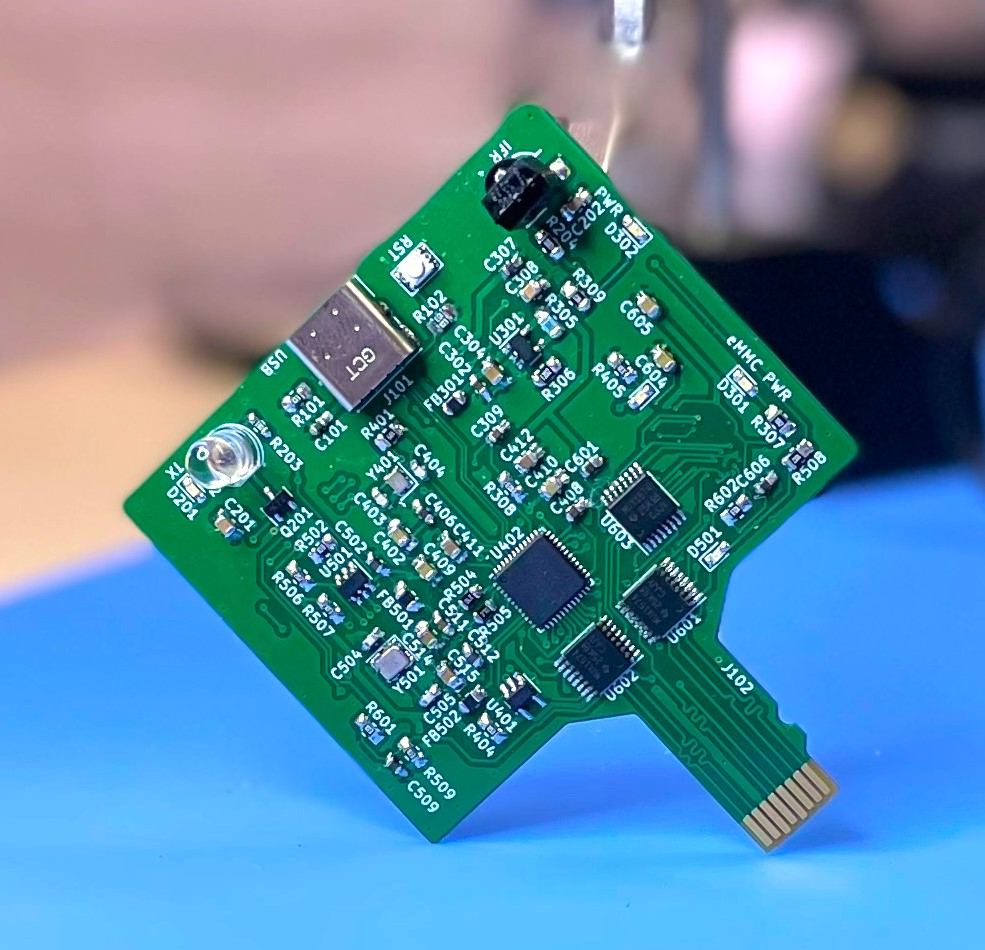
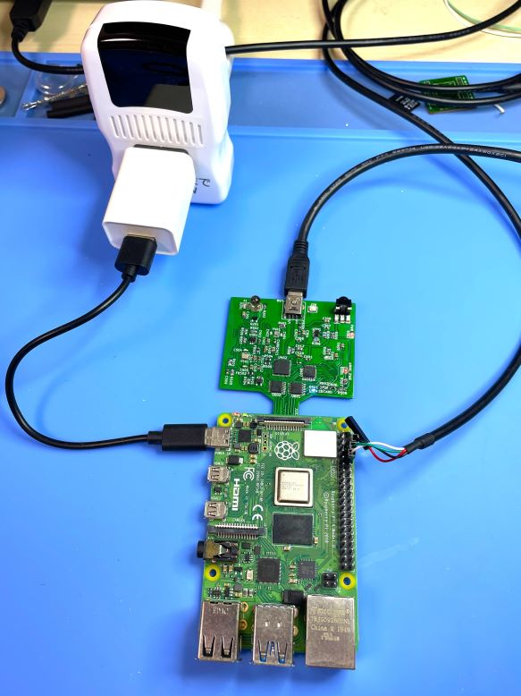
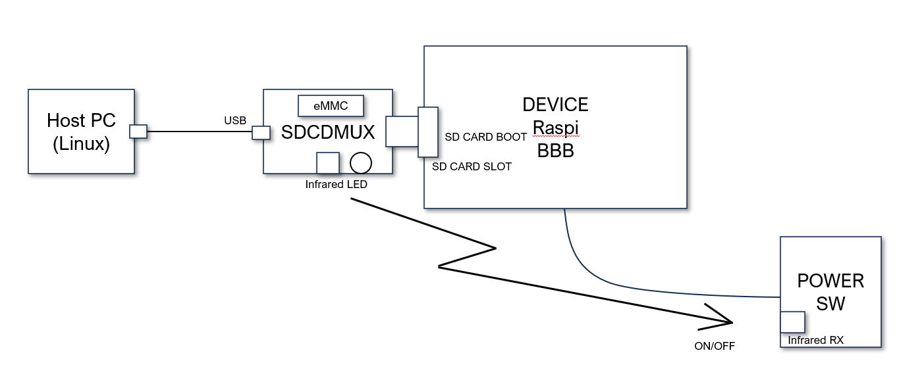
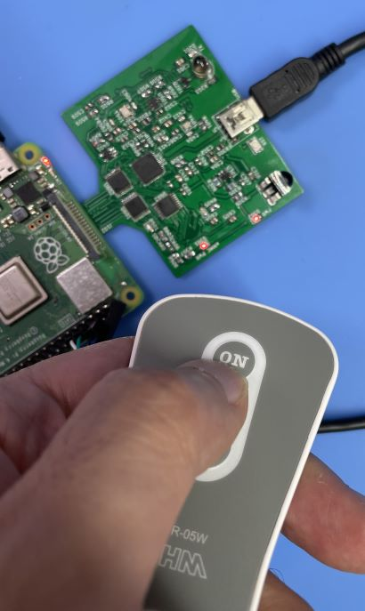
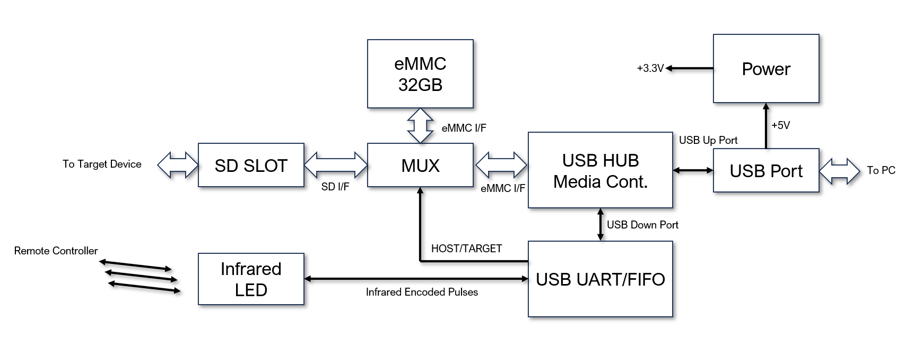
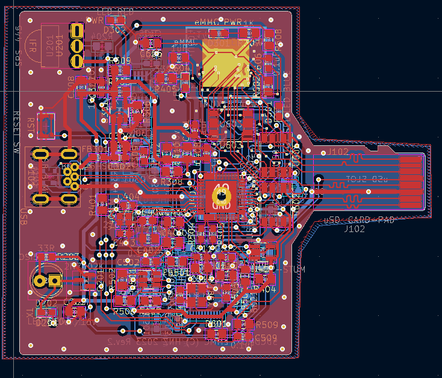
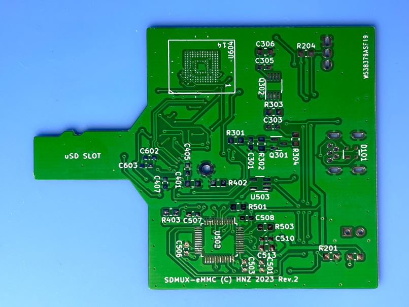

<div align="center">
  <h1><code>SDCDMUX</code></h1>
  <p>
    
  </p>
</div>

# SDCDMUX : SD Card and eMMC Device Multiplexsor with Infrared Remote Control

The SDCDMUX provides a convenient and quick change of a SW image of a device that has an SD Card interface from a remote. 

When I am developing by booting from an SD memory card on a device such as the Raspberry Pi, it is not easy to rewrite the SD card image and replace it by hand. Remove the SD card, insert it into the host PC, and take a dozen minutes rewriting the SW image, after that, return the SD card to the device and turn on the power... But, This tool can change the image of the eMMC directly from the host PC, and the device can be booted as an SD card with the new image.

Usually, To boot with the new SW image, the device must be reset, but this tool can learn the ON/OFF command of the infrared power controller and outputs that command to turn the device on and off.

This tool frees me from the tedious SW image rewriting and resetting process.


https://github.com/hnz1102/sdcdmux-emmc/assets/111413646/edf4297e-6da3-4eba-aacd-01ee126e1040


## Features

- **Fast**. SDCDMUX can write an image to the eMMC device (32GB) instead of SD Memory Card via High-Speed USB. It is 4 times faster than an SD card. 

- **Remote Control**. SDCDMUX has an infrared interface that can receive an infrared remote control command and send it to power control devices. If you want to turn on a device, you can type the command "on" on the PC console.

- **Use Fast Switch**. When I used the prototype, Sometimes Rasbery Pi4 could not boot by read error. I tried to change faster switching devices in this tool. Then, Raspberry Pi always can boot correctly.

## Tested Devices

I have checked the following devices that can boot from this tool.

- [Raspberry Pi 4 Model B](https://www.raspberrypi.com/products/raspberry-pi-4-model-b/)
- [BeagleBone Black](https://beagleboard.org/black)
- [BeagleBone Blue](https://beagleboard.org/blue)

Only 3 devices because I have my own now.

## Infrared Remote Power Switch

The Infrared Remote Contorol Power Swtich I used is [OCR-05W OHM ELECTRIC INC.](https://www.ohm-electric.co.jp/product/c23/c2313/19582/). But I think other switch devices that can control by the infrared LED may be able to work too. 

## How to build the control SW.

This software (sdcdmux) is for Linux. 

The following example is for Ubuntu Linux Ubuntu 22.04.2 LTS.

1. Install build tools
```
$ sudo apt -y install build-essential libftdi-dev
```

2. Build the software.
```
$ cd sdcdmux
$ make
$ sudo cp sdcdmux /usr/local/bin/ 
```

## How to use SDCDMUX.

1. Connect to SDCDMUX via the USB cable with your PC. Power USB cable connect to the target device and USB adoptor. Please refer to the figure. 



2. Use SDCDMUX

- Display current status.
```
$ sdcdmux
Memory Device is connected to : HOST.
```

- Capture infrared ON command.
```
$ sdcdmux -c on
Capture Start.. 
"Push ON button on your Infrared Remote Controller"
Recieve IFR data (18245B)
Captured command for on
```


After capture the command, you can see the 'if-on' file in the current directory.

- Capture infrared OFF command.
```
$ sdcdmux -c off
Capture Start.. 
"Push OFF button on your Infrared Remote Controller"
Recieve IFR data (11449B)
Captured command for off
```

- Select eMMC memory to host PC side.
```
$ sdcdmux -s host
Memory Device is connected to : HOST.
```
You can see eMMC disk drive on your PC.
```
$ lsblk
:
sdb           8:16   1  29.1G  0 disk 
:
```
In my case, I can see the new disk drive as 'sdb'.

- Download the Raspberry Pi boot image and Write it to eMMC.

** !WARNING! ** DO NOT OVERWRITE YOUR SYSTEM DISK DRIVE! BE CAREFUL THE WRITING DISK DRIVE NAME.

```
$ wget https://downloads.raspberrypi.org/raspios_armhf/images/raspios_armhf-2023-05-03/2023-05-03-raspios-bullseye-armhf.img.xz
$ xzcat 2023-05-03-raspios-bullseye-armhf.img.xz | sudo dd of=/dev/sdb bs=1M status=progress
4125163520 bytes (4.1 GB, 3.8 GiB) copied, 94 s, 43.9 MB/s
0+491118 records in
0+491118 records out
4143972352 bytes (4.1 GB, 3.9 GiB) copied, 126.121 s, 32.9 MB/s
$ lsblk
sdb           8:16   1  29.1G  0 disk 
├─sdb1        8:17   1   256M  0 part 
└─sdb2        8:18   1   3.6G  0 part 
```

- Select eMMC memory to target (Raspberry Pi) device.
```
$ sdcdmux -s target
Memory Device is connected to : TARGET.
```
You can see the blue LED is turn on.

- Turn on the device using infrared on command.
```
$ sdcdmux -x on
```

- Turn off the device using infrared on command.
```
$ sdcdmux -x off
```

- Another devices control.

I also use the SDCDMUX as a controller to turn ceiling lights on and off.
```
$ sdcdmux -c lightson
Capture Start.. 
"Press ON on the remote controller of the ceiling light to make it learn the command."
Recieve IFR data (8498B)
Captured command for lightson

$ sdcdmux -c lightsoff
Capture Start.. 
"Press OFF on the remote controller of the ceiling light to make it learn the command."
Recieve IFR data (10701B)
Captured command for lightsoff

$ sdcdmux -x lightson
"Seiling lights turn on."

$ sdcdmux -x lightsoff
"Seiling lights turn off."
```

## Performance

I created an SD card type and an eMMC type. I compared their writing times.

4.2GB Image Writing Time (Average of 3 times)
|SD card (*1)|eMMC (*2)|
|----|----|
|482.3 sec (8.7MB/s)|134.7 sec (31.3MB/s)|

*1 San Disk Ultla 32GB HC1 SD CARD

*2 Delkin Devices EM32VSUKN 32GB eMMC

## SDCDMUX Board

SDCDMUX Board Schematic and a PCB layout are placed in the hardware directory. There are 2 types emmc-version and sdcard-version. This emmc-version uses an eMMC device instead of a SD memory card.
Schematic data is created by KidCad 7.0.






If you order a PCB board from a PCB maker, it must be 0.8mm thick. Otherwise, it will not fit in the SD card slot.



After building the board, It has to configure EEPROMs of the USB Media Controller and USB FIFO Interface.

The USB Media Controller has an EEPROM. It is programmed with the parameters by [USBDM tool](https://www.microchip.com/en-us/software-library/usbdm-tool).

- Manufacture String
- Serial Number String

Single Channel HiSpeed USB to Multipurpose UART/FIFO IC (FT232H) has an EEPROM too. It is programmed the parameters by [FT_Prog](https://ftdichip.com/wp-content/uploads/2023/06/FT_Prog_v3.12.32.640-Installer.zip).

- FT EEPROM - HARDWARE Specific IO Controls - C5, C6, C8 and C9 ports are I/O Mode set.

## LICENSE
This Software is licensed under MIT. Other Hardware Schematic documents are licensed under CC-BY-SA V4.0.
